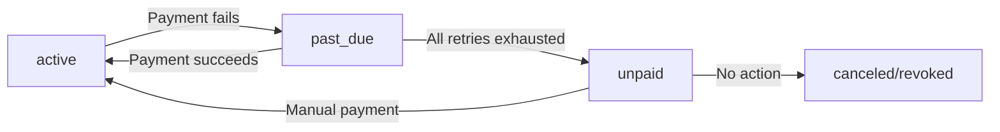

# Subscription Billing

This document covers subscription lifecycle management, billing cycles, and common subscription patterns inspired by Polar's implementation.

## Subscription State Machine

Subscriptions follow a well-defined state machine with 8 possible statuses:

```
                    ┌─────────────────────────────────────────────────────┐
                    │                                                     │
                    ▼                                                     │
┌──────────────┐   ┌──────────────┐   ┌──────────────┐   ┌──────────────┐ │
│  incomplete  │──▶│   trialing   │──▶│    active    │──▶│   canceled   │ │
└──────────────┘   └──────────────┘   └──────────────┘   └──────────────┘ │
       │                  │                  │                            │
       │                  │                  ▼                            │
       │                  │           ┌──────────────┐                    │
       │                  │           │   past_due   │────────────────────┤
       │                  │           └──────────────┘                    │
       │                  │                  │                            │
       │                  │                  ▼                            │
       │                  │           ┌──────────────┐                    │
       │                  └──────────▶│    unpaid    │────────────────────┤
       │                              └──────────────┘                    │
       │                                     │                            │
       │                                     ▼                            │
       │                              ┌──────────────┐                    │
       │                              │   revoked    │                    │
       │                              └──────────────┘                    │
       │                                                                  │
       ▼                                                                  │
┌──────────────────────┐                                                  │
│ incomplete_expired   │──────────────────────────────────────────────────┘
└──────────────────────┘
```

### Status Definitions

| Status | Description | Customer Access |
|--------|-------------|-----------------|
| `incomplete` | Initial payment not yet completed | No |
| `trialing` | In trial period, no payment yet | Yes |
| `active` | Paid and in good standing | Yes |
| `past_due` | Payment failed, in grace period | Yes (configurable) |
| `unpaid` | All retry attempts exhausted | No |
| `canceled` | Voluntarily canceled | Until period end |
| `revoked` | Forcibly terminated | No |
| `incomplete_expired` | Never completed initial payment | No |

## Core Data Model

```typescript
interface Subscription {
  id: string
  customerId: string
  productId: string
  priceId: string

  // Status
  status: SubscriptionStatus

  // Billing cycle
  currentPeriodStart: Date
  currentPeriodEnd: Date
  billingAnchor: Date

  // Trial
  trialStart: Date | null
  trialEnd: Date | null

  // Cancellation
  cancelAtPeriodEnd: boolean
  canceledAt: Date | null
  endedAt: Date | null

  // Payment
  latestInvoiceId: string | null
  defaultPaymentMethodId: string | null

  // Metadata
  metadata: Record<string, string>
  createdAt: Date
  updatedAt: Date
}

type SubscriptionStatus =
  | 'incomplete'
  | 'trialing'
  | 'active'
  | 'past_due'
  | 'unpaid'
  | 'canceled'
  | 'revoked'
  | 'incomplete_expired'
```

## Creating Subscriptions

### Basic Subscription

```typescript
import { payments } from 'payments.do'

const subscription = await payments.subscriptions.create({
  customer: 'cus_123',
  price: 'price_pro_monthly'
})
```

### Subscription with Trial

```typescript
const subscription = await payments.subscriptions.create({
  customer: 'cus_123',
  price: 'price_pro_monthly',
  trialPeriodDays: 14
})

// Or with explicit trial end
const subscription = await payments.subscriptions.create({
  customer: 'cus_123',
  price: 'price_pro_monthly',
  trialEnd: new Date('2024-02-15')
})
```

### Subscription with Custom Billing Anchor

```typescript
// Bill on the 1st of each month
const subscription = await payments.subscriptions.create({
  customer: 'cus_123',
  price: 'price_pro_monthly',
  billingCycleAnchor: new Date('2024-01-01'),
  prorationBehavior: 'create_prorations'
})
```

## Trial Period Management

### Trial Behavior Options

```typescript
interface TrialSettings {
  // Number of days for trial
  trialPeriodDays?: number

  // Explicit trial end date
  trialEnd?: Date | 'now'

  // Require payment method upfront?
  paymentBehavior?: 'default_incomplete' | 'allow_incomplete'

  // What happens when trial ends without payment method?
  trialEndBehavior?: 'pause' | 'cancel' | 'create_invoice'
}
```

### Trial-to-Paid Conversion

```typescript
// When trial ends, Stripe automatically:
// 1. Creates an invoice for the first billing period
// 2. Attempts to charge the default payment method
// 3. Updates subscription status based on result

// Monitor conversion events
payments.webhooks.on('subscription.updated', async (event) => {
  const subscription = event.data

  if (subscription.status === 'active' && event.previousAttributes?.status === 'trialing') {
    // Trial converted successfully
    await notifyTrialConverted(subscription)
  }
})
```

### Extending Trials

```typescript
// Extend trial by 7 more days
await payments.subscriptions.update(subscription.id, {
  trialEnd: new Date(Date.now() + 7 * 24 * 60 * 60 * 1000)
})

// End trial immediately (start billing)
await payments.subscriptions.update(subscription.id, {
  trialEnd: 'now'
})
```

## Subscription Changes

### Upgrades and Downgrades

```typescript
// Upgrade to a higher tier
await payments.subscriptions.update(subscription.id, {
  price: 'price_enterprise_monthly',
  prorationBehavior: 'create_prorations'
})

// Downgrade effective at period end (no proration)
await payments.subscriptions.update(subscription.id, {
  price: 'price_basic_monthly',
  prorationBehavior: 'none',
  effectiveDate: 'next_period'
})
```

### Proration Behavior

| Behavior | Description | Use Case |
|----------|-------------|----------|
| `create_prorations` | Charge/credit difference immediately | Upgrades |
| `always_invoice` | Create and pay invoice immediately | High-value upgrades |
| `none` | No proration, new price at next period | Downgrades |

### Proration Calculation

```typescript
// Example: Upgrade from $10/mo to $50/mo on day 15 of 30
const upgrade = {
  daysRemaining: 15,
  oldDaily: 10 / 30,     // $0.33/day
  newDaily: 50 / 30,     // $1.67/day

  // Credit for unused time on old plan
  credit: 15 * 0.33,     // $5.00

  // Charge for remaining time on new plan
  charge: 15 * 1.67,     // $25.00

  // Net charge
  prorationAmount: 25 - 5 // $20.00
}
```

### Previewing Changes

```typescript
// Preview proration before applying
const preview = await payments.subscriptions.previewUpdate(subscription.id, {
  price: 'price_enterprise_monthly'
})

console.log({
  immediateCharge: preview.prorationAmount,
  newMonthlyAmount: preview.recurringAmount,
  effectiveDate: preview.effectiveDate
})
```

## Cancellation Flows

### Cancel at Period End (Recommended)

```typescript
// Customer keeps access until period ends
await payments.subscriptions.update(subscription.id, {
  cancelAtPeriodEnd: true
})

// subscription.status remains 'active'
// subscription.cancelAtPeriodEnd = true
// subscription.canceledAt = now
```

### Immediate Cancellation

```typescript
// Revoke access immediately
await payments.subscriptions.cancel(subscription.id)

// subscription.status = 'canceled'
// subscription.endedAt = now
```

### Cancellation with Refund

```typescript
// Cancel and refund unused time
await payments.subscriptions.cancel(subscription.id, {
  prorate: true,
  invoiceNow: true  // Create final invoice with credit
})
```

### Reactivating Canceled Subscriptions

```typescript
// Before period ends, can undo cancellation
if (subscription.cancelAtPeriodEnd && subscription.status === 'active') {
  await payments.subscriptions.update(subscription.id, {
    cancelAtPeriodEnd: false
  })
}

// After subscription ends, must create new subscription
if (subscription.status === 'canceled') {
  await payments.subscriptions.create({
    customer: subscription.customerId,
    price: subscription.priceId
  })
}
```

## Failed Payment Handling

### Retry Schedule

```typescript
// Default retry schedule (configurable)
const retrySchedule = [
  { attempt: 1, delay: 0 },           // Immediate
  { attempt: 2, delay: 3 * 24 * 60 }, // 3 days
  { attempt: 3, delay: 5 * 24 * 60 }, // 5 days
  { attempt: 4, delay: 7 * 24 * 60 }, // 7 days (final)
]
```

### Status Transitions on Failure



### Dunning Management

```typescript
// Configure dunning behavior
await payments.subscriptions.configureDunning({
  // Grace period while past_due
  gracePeriodDays: 14,

  // Send reminder emails
  sendReminders: true,
  reminderDays: [3, 7, 14],

  // Final action after grace period
  finalAction: 'cancel', // or 'pause' or 'revoke'

  // Revoke access during past_due?
  revokeAccessDuringGrace: false
})
```

### Handling Past Due Subscriptions

```typescript
payments.webhooks.on('subscription.updated', async (event) => {
  const subscription = event.data

  if (subscription.status === 'past_due') {
    // Payment failed - notify customer
    await sendPaymentFailedEmail(subscription.customerId, {
      nextRetryDate: subscription.nextRetryDate,
      updatePaymentUrl: await generateUpdatePaymentUrl(subscription.customerId)
    })
  }

  if (subscription.status === 'unpaid') {
    // All retries exhausted - final warning
    await sendFinalWarningEmail(subscription.customerId, {
      gracePeriodEnds: subscription.gracePeriodEnd,
      reactivateUrl: await generateReactivateUrl(subscription.id)
    })
  }
})
```

## Multi-Item Subscriptions

### Adding Multiple Products

```typescript
const subscription = await payments.subscriptions.create({
  customer: 'cus_123',
  items: [
    { price: 'price_base_monthly' },
    { price: 'price_addon_users', quantity: 5 },
    { price: 'price_addon_storage', quantity: 100 }
  ]
})
```

### Updating Quantities

```typescript
// Update seat count
await payments.subscriptions.updateItem(subscription.id, {
  priceId: 'price_addon_users',
  quantity: 10
})
```

### Adding/Removing Items

```typescript
// Add new item to existing subscription
await payments.subscriptions.addItem(subscription.id, {
  price: 'price_addon_api',
  quantity: 1
})

// Remove item
await payments.subscriptions.removeItem(subscription.id, {
  priceId: 'price_addon_api'
})
```

## Billing Cycle Management

### Billing Anchors

```typescript
// Subscription created mid-month
// Option 1: Bill immediately for full period
const sub1 = await payments.subscriptions.create({
  customer: 'cus_123',
  price: 'price_monthly',
  billingCycleAnchor: 'now'
})

// Option 2: Prorate first period, anchor to specific date
const sub2 = await payments.subscriptions.create({
  customer: 'cus_123',
  price: 'price_monthly',
  billingCycleAnchor: new Date('2024-02-01'),
  prorationBehavior: 'create_prorations'
})

// Option 3: Bill immediately, then anchor to signup date
const sub3 = await payments.subscriptions.create({
  customer: 'cus_123',
  price: 'price_monthly',
  // First period: today to end of month
  // Then: 1st of each month
  billingCycleAnchorConfig: {
    dayOfMonth: 1
  }
})
```

### Anniversary vs Calendar Billing

```typescript
// Anniversary billing (default)
// Customer signs up Jan 15 → bills on 15th of each month
const anniversary = await payments.subscriptions.create({
  customer: 'cus_123',
  price: 'price_monthly'
})

// Calendar billing
// Customer signs up Jan 15 → prorated Jan 15-31, then bills on 1st
const calendar = await payments.subscriptions.create({
  customer: 'cus_123',
  price: 'price_monthly',
  billingCycleAnchorConfig: {
    dayOfMonth: 1
  },
  prorationBehavior: 'create_prorations'
})
```

## Pause and Resume

### Pausing Subscriptions

```typescript
// Pause billing (customer keeps limited access)
await payments.subscriptions.pause(subscription.id, {
  behavior: 'void_invoices', // or 'keep_as_draft'
  resumeAt: new Date('2024-03-01') // Optional auto-resume
})
```

### Resuming Subscriptions

```typescript
// Resume paused subscription
await payments.subscriptions.resume(subscription.id, {
  prorationBehavior: 'create_prorations'
})
```

## Subscription Schedules

For complex billing changes that should take effect in the future:

```typescript
// Schedule a price change for next month
const schedule = await payments.subscriptions.createSchedule({
  subscriptionId: subscription.id,
  phases: [
    {
      // Current phase
      price: 'price_pro_monthly',
      endDate: subscription.currentPeriodEnd
    },
    {
      // Starting next period
      price: 'price_enterprise_monthly',
      iterations: null // Indefinite
    }
  ]
})

// Cancel scheduled change
await payments.subscriptions.cancelSchedule(schedule.id)
```

## Implementation Checklist

### Subscription Service

- [ ] Create subscription with validation
- [ ] Handle trials (create, extend, end)
- [ ] Process upgrades/downgrades with proration
- [ ] Implement cancellation flows
- [ ] Handle failed payments and dunning
- [ ] Support pause/resume
- [ ] Manage subscription schedules

### Webhook Handlers

- [ ] `subscription.created` - Welcome email, provision access
- [ ] `subscription.updated` - Status change handling
- [ ] `subscription.trial_will_end` - Reminder email (3 days before)
- [ ] `subscription.past_due` - Payment failure notification
- [ ] `subscription.canceled` - Offboarding, feedback request
- [ ] `invoice.payment_succeeded` - Receipt, status update
- [ ] `invoice.payment_failed` - Retry notification

### Customer Experience

- [ ] Subscription management UI
- [ ] Plan comparison/selection
- [ ] Proration preview before changes
- [ ] Cancellation flow with retention offers
- [ ] Payment method update flow
- [ ] Invoice history

## Related Documentation

- [ARCHITECTURE.md](./ARCHITECTURE.md) - Overall payments architecture
- [STRIPE-CONNECT.md](./STRIPE-CONNECT.md) - Platform and payout handling
- [METERED-BILLING.md](./METERED-BILLING.md) - Usage-based billing
- [WEBHOOKS.md](./WEBHOOKS.md) - Event handling patterns
- [CUSTOMER-PORTAL.md](./CUSTOMER-PORTAL.md) - Self-service portal
