# Durable Objects

**The building blocks of autonomous startups.**

You have a vision: a startup that runs itself. AI agents working 24/7. Humans stepping in only when needed. Metrics tracked, workflows automated, decisions logged. But between your vision and reality stands a wall of infrastructure complexity.

*What if you could just... start?*

## The Challenge

Building autonomous systems is hard. You need:
- **Persistent state** that survives restarts
- **AI agents** that remember and learn
- **Human oversight** at critical decision points
- **Workflows** that orchestrate everything
- **Organizations** with roles, permissions, and billing

Traditional approaches bury you in databases, queues, and glue code. By the time you've built the infrastructure, you've lost your momentum.

## The Solution

**Durable Objects that DO the work for you.**

Each object is a complete, self-contained unit of business logic with:
- Built-in SQLite database (via Drizzle ORM)
- Multi-transport access (HTTP, WebSocket, RPC)
- AI integration ready
- Zero infrastructure to manage

```typescript
// Your startup, defined in code
const startup = await env.STARTUP.get(id)
await startup.addFounder({ name: "Alex", title: "CEO" })
await startup.recordMetrics({ mrr: 50000, users: 1200 })
await startup.closeRound("seed", 2_000_000, 12_000_000)
```

---

## The Objects

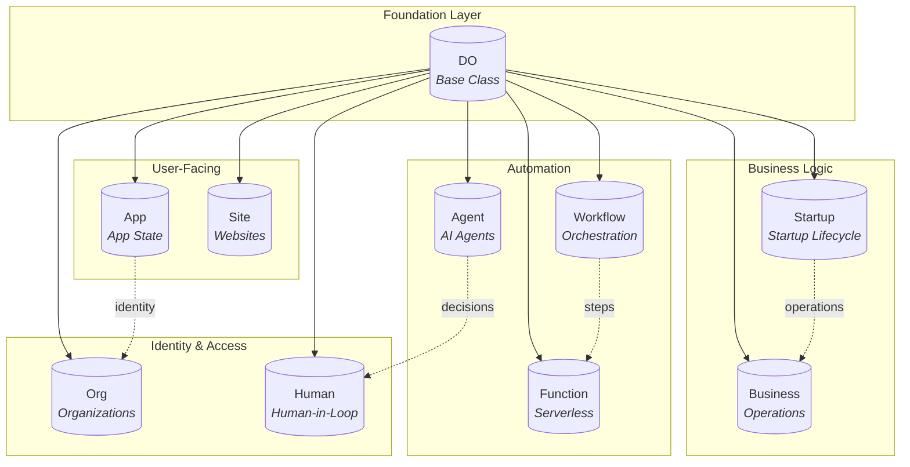

---

### DO — The Foundation

Every object extends `DO`, giving you:

| Feature | What You Get |
|---------|--------------|
| **SQLite** | Embedded database with Drizzle ORM |
| **Multi-transport** | HTTP, WebSocket, Workers RPC, CapnWeb |
| **AI Integration** | Ready for `env.LLM` bindings |
| **Strong Consistency** | Single-threaded execution model |

```typescript
import { DO } from 'dotdo'

export class MyObject extends DO {
  db = drizzle(this.ctx.storage.sql, { schema })

  async doAnything(input: any) {
    // Your logic here, with full database access
  }
}
```

---

### Startup — Define Your Startup in Code

Track the complete startup lifecycle: founders, funding, metrics, investors, and milestones.

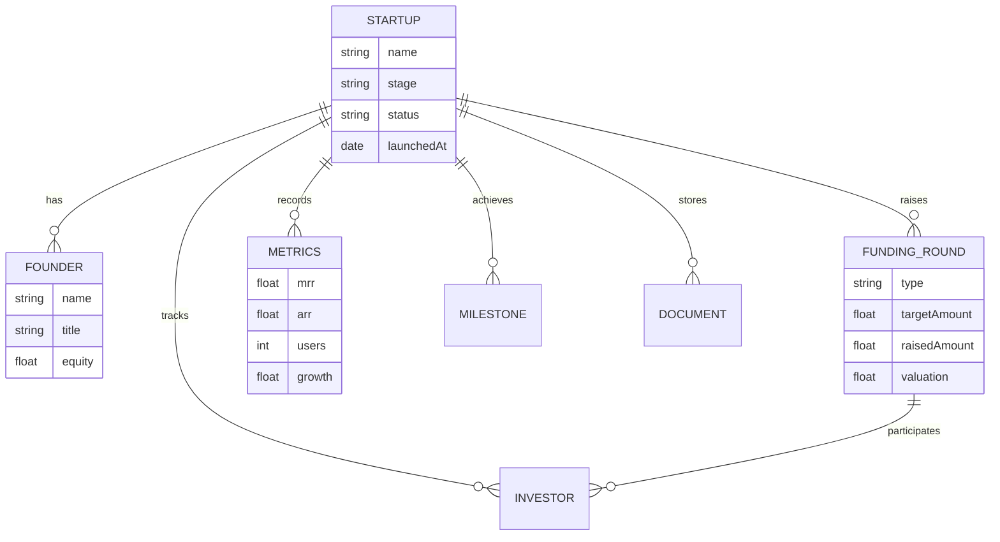

**Key Capabilities:**
- Track MRR, ARR, users, growth, runway
- Manage funding rounds and investors
- Generate investor updates with AI
- Store pitch decks and documents

```typescript
const startup = await env.STARTUP.get(id)
const dashboard = await startup.getDashboard(startupId)
// { startup, team, funding, metrics, milestones, pitchDeck }
```

---

### Business — Your Operational Hub

Manage teams, subscriptions, metrics, and settings for day-to-day operations.

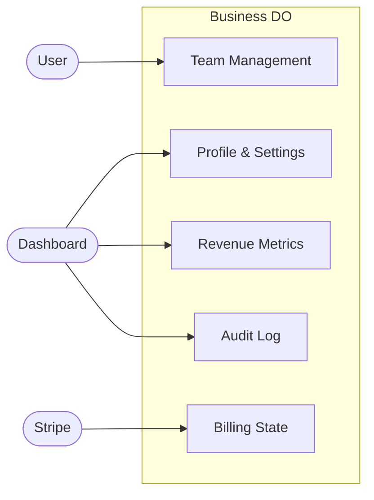

**Perfect for:**
- SaaS applications with teams
- Subscription-based products
- Any business tracking MRR/ARR

---

### Org — Enterprise Identity

Multi-tenant organization management with roles, SSO, and audit logging.

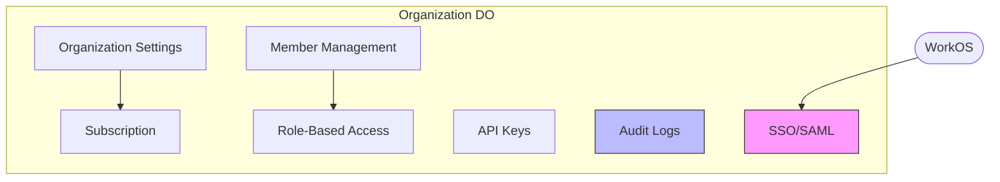

**Enterprise Features:**
- SAML/OIDC single sign-on
- Fine-grained permissions (`org:admin`, `members:*`)
- Seat-based billing
- Complete audit trail

```typescript
const org = await env.ORG.get(orgId)
await org.inviteMember({ email: "team@example.com", roleId: "admin" })
const hasAccess = await org.hasPermission(memberId, "billing:write")
```

---

### Agent — AI That Remembers

Persistent AI agents with memory, goals, actions, and learning.

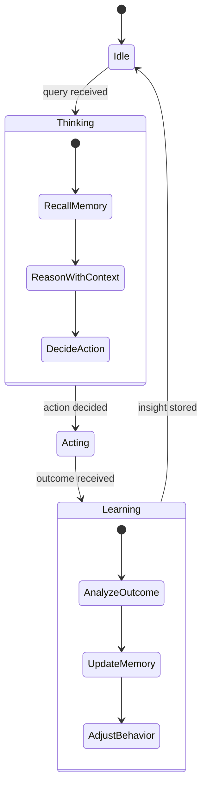

**Agent Capabilities:**
- **Memory**: Long-term recall with importance scoring
- **Goals**: Track progress toward objectives
- **Actions**: Register and execute custom handlers
- **Learning**: Improve from feedback and reflection

```typescript
export class SupportAgent extends Agent {
  async init() {
    this.registerAction('resolveTicket', {
      description: 'Resolve customer ticket',
      handler: async ({ ticketId }) => this.resolve(ticketId)
    })

    await this.setGoal({
      description: 'Resolve 95% of tickets without escalation',
      metric: 'resolution_rate',
      target: 0.95
    })
  }
}
```

---

### Workflow — Orchestrate Everything

Multi-step workflows with retries, branching, and durable execution.

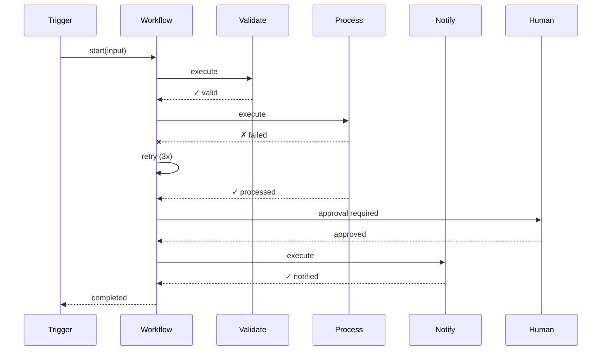

**Workflow Features:**
- Durable execution across failures
- Automatic retries with backoff
- Conditional branching
- Wait/pause/resume
- Event-driven triggers

```typescript
await workflow.register({
  id: 'onboarding',
  steps: [
    { id: 'validate', action: 'validateUser' },
    { id: 'provision', action: 'createAccount', dependsOn: ['validate'] },
    { id: 'welcome', action: 'Email.send', params: { template: 'welcome' } }
  ]
})

await workflow.start('onboarding', { email: 'user@example.com' })
```

---

### Human — Keep Humans in the Loop

Task queues and approval workflows for human oversight.

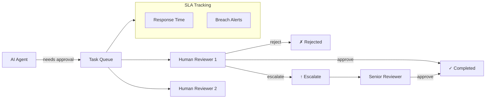

**Human-in-the-Loop:**
- Task queues with priority and SLA
- Approval workflows
- Escalation chains
- Feedback collection for AI improvement

```typescript
const human = await env.HUMAN.get(id)
const task = await human.createTask({
  type: 'approval',
  title: 'Review AI-generated content',
  context: { content, confidence: 0.85 },
  escalationChain: [
    { level: 1, assignees: ['reviewer@example.com'], timeoutMs: 3600000 },
    { level: 2, assignees: ['manager@example.com'], timeoutMs: 7200000 }
  ]
})
```

---

### Function — Serverless with State

Add versioning, metrics, and observability to your functions.

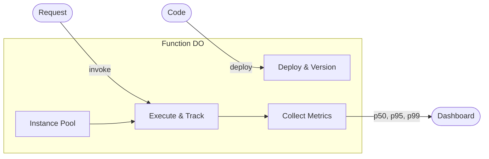

**Function Features:**
- Automatic versioning with rollback
- Execution tracking and logging
- Per-function rate limiting
- Cold start optimization
- Resource usage metrics

---

### App — Complete App State

Everything your app needs: users, sessions, feature flags, and analytics.

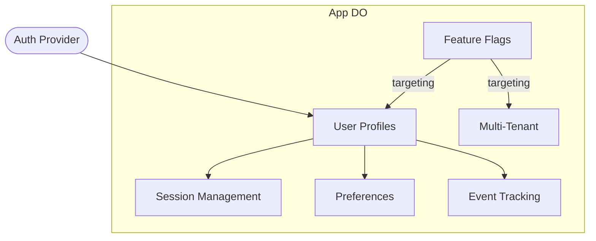

**App Capabilities:**
- User profiles with external auth integration
- Session management
- Feature flags with rollout targeting
- Event analytics
- Multi-tenant support

---

### Site — Ship Websites Fast

Pages, posts, media, SEO, and analytics for content-driven sites.

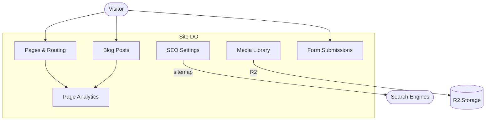

**Site Features:**
- Page and post management
- Media library with R2 storage
- SEO configuration and sitemap generation
- Real-time analytics
- Form submission handling

---

## How They Work Together

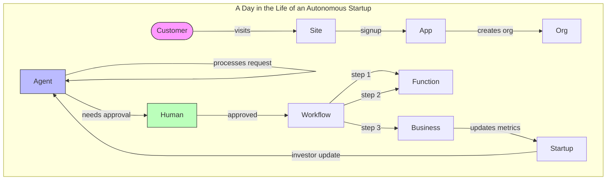

**Example: AI Customer Support**

1. **Site** captures lead via form
2. **App** creates user, assigns to **Org**
3. **Agent** handles support query
4. **Agent** escalates complex case to **Human**
5. **Human** approves resolution
6. **Workflow** executes follow-up sequence
7. **Business** records customer metrics
8. **Startup** updates MRR tracking

---

## Getting Started

### 1. Choose Your Starting Point

| Starting Point | Use Case |
|----------------|----------|
| `Startup` | Building a startup, tracking metrics and funding |
| `Business` | SaaS with teams and subscriptions |
| `Org` | Enterprise multi-tenant application |
| `Agent` | AI-first product |
| `Site` | Content-driven website or landing pages |

### 2. Install and Import

```bash
# All objects in one package
pnpm add @dotdo/objects

# Or individual packages
pnpm add dotdo @dotdo/startup @dotdo/agent
```

```typescript
// From umbrella package
import { Startup, Agent, Workflow } from '@dotdo/objects'

// Or from individual packages
import { Startup } from '@dotdo/startup'
import { Agent } from '@dotdo/agent'
import { Workflow } from '@dotdo/workflow'
```

### 3. Export and Configure

```typescript
// wrangler.toml
[[durable_objects.bindings]]
name = "STARTUP"
class_name = "Startup"

[[durable_objects.bindings]]
name = "AGENT"
class_name = "CustomerSupportAgent"
```

### 4. Use in Your Worker

```typescript
export default {
  async fetch(request, env) {
    const startup = await env.STARTUP.get(env.STARTUP.idFromName('my-startup'))
    return startup.fetch(request)
  }
}

export { Startup } from 'startup.do'
```

---

## The Result

**Before:** Months of infrastructure work before shipping.

**After:** Your autonomous startup, running today.

```typescript
// Define your startup
const startup = await env.STARTUP.create({
  name: "Acme AI",
  stage: "seed",
  industry: "AI/ML"
})

// AI agents working 24/7
const agent = await env.AGENT.init()
await agent.setGoal({ description: "Close 10 deals this month" })

// Humans step in when needed
const task = await env.HUMAN.createTask({
  type: "approval",
  title: "Review $100k contract"
})

// Everything tracked, everything auditable
const dashboard = await startup.getDashboard(startup.id)
```

---

## Package Reference

### All-in-One

```bash
pnpm add @dotdo/objects
```

```typescript
import { DO, Agent, Startup, Workflow, Human } from '@dotdo/objects'

// Or import specific objects
import { Agent } from '@dotdo/objects/agent'
import { Startup } from '@dotdo/objects/startup'
```

### Individual Packages

| Object | Package | Domain | Description |
|--------|---------|--------|-------------|
| DO | `dotdo` | — | Base Durable Object class |
| Startup | `@dotdo/startup` | `startup.do` | Startup lifecycle management |
| Business | `@dotdo/business` | `business.do` | Business operations |
| Org | `@dotdo/org` | `org.do` | Organization & identity |
| Agent | `@dotdo/agent` | `agent.do` | AI agents with memory |
| Workflow | `@dotdo/workflow` | `workflow.do` | Workflow orchestration |
| Function | `@dotdo/function` | `function.do` | Serverless with state |
| Human | `@dotdo/human` | `human.do` | Human-in-the-loop |
| App | `@dotdo/app` | `app.do` | Complete app state |
| Site | `@dotdo/site` | `site.do` | Website management |

---

<div align="center">

**Ready to build an autonomous startup?**

[Get Started](https://workers.do) · [Documentation](https://docs.workers.do) · [Examples](https://github.com/workers-do/examples)

</div>
